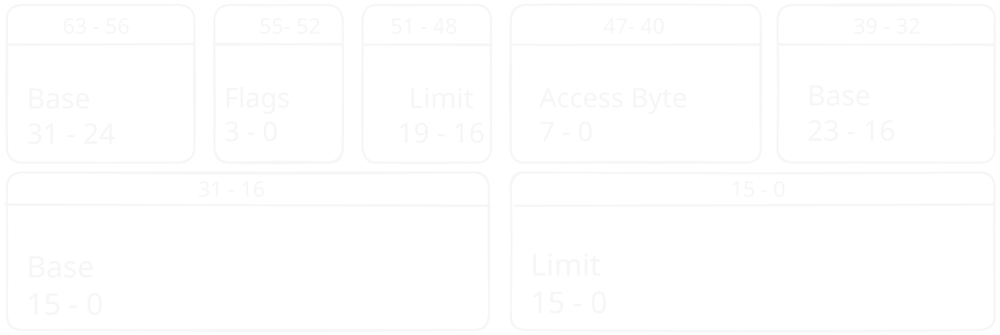

# Entering Protected Mode

_"With great power comes great responsibility." - Voltaire / Spider-Man_

---

As you may recall from previous chapters, our BIOS only loads the first sector to RAM, which leaves about just shy of 512 bytes[^1].
After we read from disk, it will enable us to write much more code, because we will not be limited to 512 bytes.
But just before we do that, we don't want to limit ourselves to only 16bit instructions.
For that we need to enter [`protected mode`](https://en.wikipedia.org/wiki/Protected_mode) which will allow us to unlock some CPU features such as 32bit instructions.

[^1]: 446 bytes to be exact. This number is derived by removing the size of the partition table (64 bytes) and the size of the boot signature(2 bytes) from the sector size (512 bytes). 

Entering protected mode requires us to initialize the [`Global Descriptor Table`](https://wiki.osdev.org/Global_Descriptor_Table) (GDT) which is a CPU structure that will be discussed in depth below, as well as toggling the protected mode bit in [`cr0`](https://en.wikipedia.org/wiki/Control_register).


## The Global Descriptor Table

> _All the information about the Global Descriptor Table is taken from both the [Intel Manual Volume 3A](https://www.google.com/url?sa=t&source=web&rct=j&opi=89978449&url=https://www.intel.com/content/dam/www/public/us/en/documents/manuals/64-ia-32-architectures-software-developer-vol-3a-part-1-manual.pdf&ved=2ahUKEwjK-duH0pOUAxXvhf0HHRkeN1sQFnoECA0QAQ&usg=AOvVaw3xCH_sFKn73Bg5tPFbOzaC) section 3.4.5, and the great [osdev](https://wiki.osdev.org/GDT_Tutorial) website._

This is a structure that is specific to the x86 CPU family, and it contains information about the different segments.
In general, segments are used to divide memory into logical parts, and to translate addresses as we seen in real mode.

_Address translation with the GDT will not be wildly used in this chapter, because it will not be used throughout the OS. Instead, memory paging will be used and explained in the next chapter._
_For now, think of a memory segment as a fixed size blob of contiguous physical memory._ 

In protected mode, the common way to organize memory is using these segments. Because segment registers[^2] hold only one number,
they can't hold enough information for us. That is where the Global Descriptor Table comes in place.
The Global Descriptor Table is an array of structures that include information about a segment.
When we want to use our custom segment, we load its offset on the GDT to the segment register.
For example, we can create a segment for user data at index 1 of our table.
This segment will not hold important data for the system or code that can be executed.
If we want to load it into the `ds` we will set it to the offset of the structure in the table.

_Each entry is 8 bytes long, index one will be at an offset of 8, which means we will set `ds=8`_

[^2]: Registers like cs, ds, gs, fs, ss, etc.

> Instead of just revealing the structure that is used for each segment, I want you to pause and ponder: what information should each segment include?
>
> _Remember that some instructions assume segments, like mov, jmp etc. and we want segments for the kernel, users, data and code._

When I asked myself this question, I came up with the following ideas:
- What is the initial address of the segment. i.e the start address in memory where the segment starts.
- What is the end address of the segment. i.e the end address in memory where the segment ends.
- What the segment includes. i.e data segment, code segment etc.
- What is the privilege level of the segment. i.e can anyone access it or only the kernel
- For a data segment, Is the data read only, or may I modify it?
- For a code segment, can I execute it or not yet.

If you guessed something similar to this, you are mostly correct!

Our entry will look like this:
<figure style="margin: 0; text-align: center">
  
  <figcaption><strong>Figure 2-1:</strong> global descriptor table entry structure</figcaption>
</figure>


But what are these fields?
- **Base:** This is a 32-bit value, which is split on the entire entry and represents the address of where the segment begins.
- **Limit:** This is a 20-bit value, which is split on the entire entry and represents the size of the segment.
- **Access Byte:** Flags that are relevant to the memory range of the segment,
like the access privileges of this segment.
- **Flags:** General flags that are relevant for the entry fields.

All of these fields will become a struct and together they represent a single entry in our GDT.


Both the `AccessByte`, the `LimitFlags`, and more structures throughout the book, are using one bit flags, which represent some inner settings of the CPU.
Although setting a one bit flag is easy, and can be done with `1 << bit_number` to set the nth bit, we would like abstractions such as `set_<flag_name>`, which are more readable and less prone to errors.
But, if we would do that to every flag, it will be **A LOT** of boilerplate code.
For this reason, Rust provides us with an amazing macro system.

<blockquote>

If you read through some previous version of this book, you may have seen the explanation of the [flag!](https://github.com/sagi21805/LearnixOS/blob/c6560ef225262a3cfea58d5a5eae716ddb082ff3/learnix-macros/src/lib.rs#L74) proc-macro, which was used like this:

<pre><code class="language-rust icon=@https://www.rust-lang.org/static/images/rust-logo-blk.svg hljs"><span class="hlrs-keyword">impl</span> <span class="hlrs-type">AccessByte</span> {
    <span class="hlrs-macro">flag</span><span class="hlrs-macro">!</span>(<span class="hlrs-function">readable</span>, <span class="hlrs-litnum">1</span>);
}
</code></pre>

This macro was used to define those exactly 1 bit flags. But as it will turn out, this is not enough, and more functionality will be needed. 

</blockquote>

The problem with this macro is that it had to be called for each bit flag. Because it did not take multiple flags, the macro did not have enough context to generate a [Debug](https://doc.rust-lang.org/std/fmt/trait.Debug.html) trait implementation that shows bit flag names.

_More problems that I was having, but not a direct outcome of the initial design, is that flags sometimes contain more than 1 bit, and may contain n bits, also, certain n bit flags may have a specific set of values that are valid, and we may want to name them in an enum._

The current design of the macro looks like this:

```rust
#![struct!("crates/arch/x86/src/structures/global_descriptor_table.rs", AccessByte)]
```

As you can see, we have the macro attribute at the top of our struct, which is called `bitfields`.

- Each field in this struct is a flag, and as you can see, the highlighter is smart and can expand our macro, so the color of the fields are the same as a function.

- The type of each field represents the flag width in bits. B1 is one bit and B20 is 20 bits.

- Some flags may have their own attribute such as `r` and `w` which create a read function and a write function, respectively. When they are not defined, both functions are created.

- Flags may also contain types, which are mostly enums that contains the valid values, or even all the values but gives them a readable name.

- While this macro seems complex, it will just create the functions that will help us to set flags in a convenient way.

<blockquote>

To see what this macro generated, we can use the amazing [`cargo-expand`](https://crates.io/crates/cargo-expand) tool created by [`David Tolnay`](https://github.com/dtolnay)

<details>
<summary>For example, the expansion of the call above.</summary>

```rust
#![source_file!("snippets/src/book/ch02_02/flag_macro_expand.rs", 1:999)]
```
</details>
</blockquote>

If this macro seems really cool and complicated, that's great! because it will be fully explained and implemented in [later chapters](./ch02-03-implementing-the-bitfields-proc-macro.md).

_We will also define an enum that will include the protection level and the system segment flags so that they have clear names._

```rust
#![enum!("crates/common/src/enums/general.rs", ProtectionLevel)]
#![enum!("crates/common/src/enums/global_descriptor_table.rs", SegmentDescriptorType)]
```


Now, just before creating a `new` function for our entry, we don't want to specify the base in three parts and the limit in two parts every time. Instead, we want the `new` function to do that for us.

```rust
#![struct!("crates/arch/x86/src/structures/global_descriptor_table.rs", GlobalDescriptorTableEntry32)]
#![impl_method!("crates/arch/x86/src/structures/global_descriptor_table.rs", GlobalDescriptorTableEntry32::new)]
```
## Jumping to the next stage!

Now, after understanding the Global Descriptor Table, we want to jump to the next stage.
This will require us to create and load a temporary Global Descriptor Table.

Each table must have at least three entries: an initial `null` entry that is filled with zeros, which is always required as the first entry; a `data` entry for the data segment, so we can read and write to memory; and a `code` entry, so we can execute code.

Together it will all look like this:

```rust
#![struct!("crates/arch/x86/src/structures/global_descriptor_table.rs", GlobalDescriptorTableProtected)]
#![impl_method!("crates/arch/x86/src/structures/global_descriptor_table.rs", GlobalDescriptorTableProtected::default)]
```

If you noticed, all of the functions that we defined so far are marked with `const`. this is useful because we can create our Global Descriptor Table as a static variable, which will be in the binary.
This is useful because it will initialize our Global Descriptor Table during compile time.

So, the only thing left to do is to load the Global Descriptor Table. This can be done with the `lgdt` instruction which loads the `Global Descriptor Table Register` with our table. This is a hidden register that includes information about our Global Descriptor Table, like it's size and address in memory.

We will create a `load` function that will create this register structure and load it to the CPU.

```rust
#![struct!("crates/arch/x86/src/structures/global_descriptor_table.rs", GlobalDescriptorTableRegister)]
#![impl_method!("crates/arch/x86/src/structures/global_descriptor_table.rs", GlobalDescriptorTableProtected::load)]
```

Now, to apply all of the created functionality, enable protected mode, and finally jump to the next stage, we need to add the following code to our entry function.

But just before that, when we jump to the next stage, we need to specify the offset in the GDT of the relevant section we want to jump to, which will load the `cs` segment register with that value. In that case it is the `kernel_code` section that will allow us to run code on ring0. For an easy way to specify the section, we will create an enum.

_Notice that this also contains segments of another GDT that we will used in the following chapters._

```rust
#![enum!("crates/common/src/enums/global_descriptor_table.rs", Sections)]
```

```rust
#![static!("bootloader/first_stage/src/main.rs", GLOBAL_DESCRIPTOR_TABLE)]
#![function!("bootloader/first_stage/src/main.rs", enter_protected_mode)]
```

- [x] Load the global descriptor table
