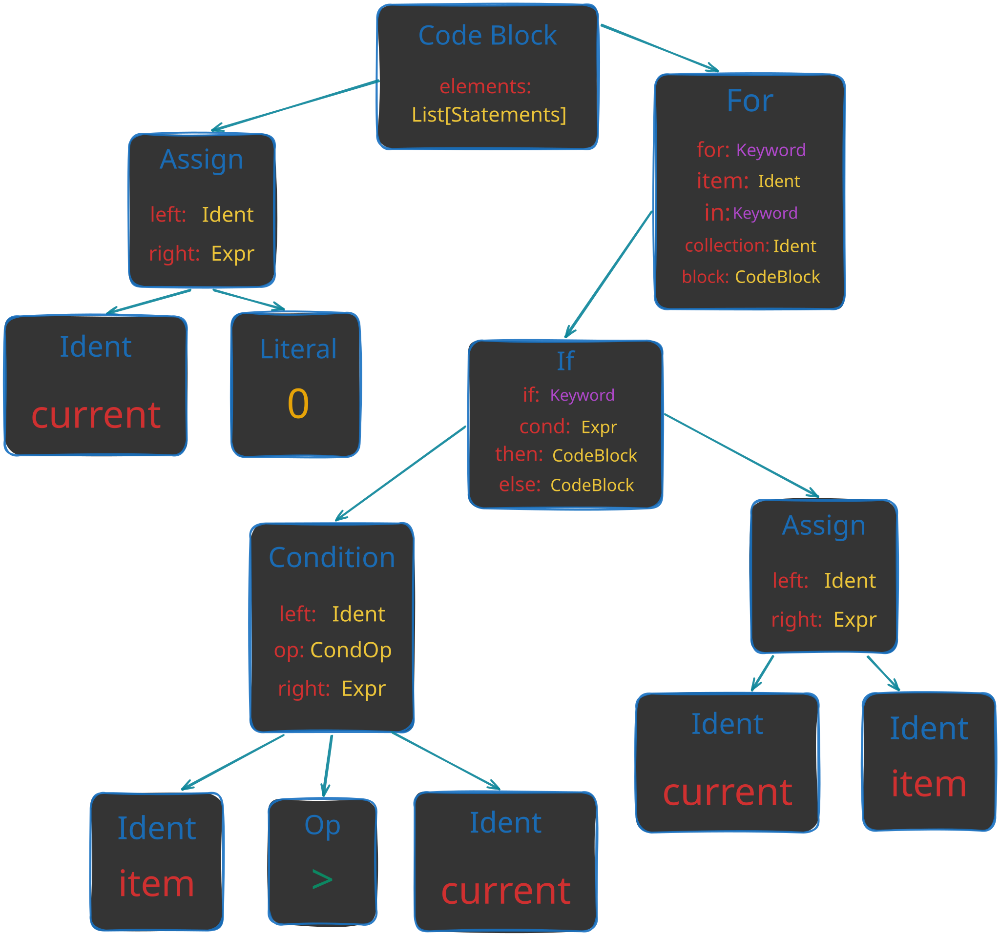
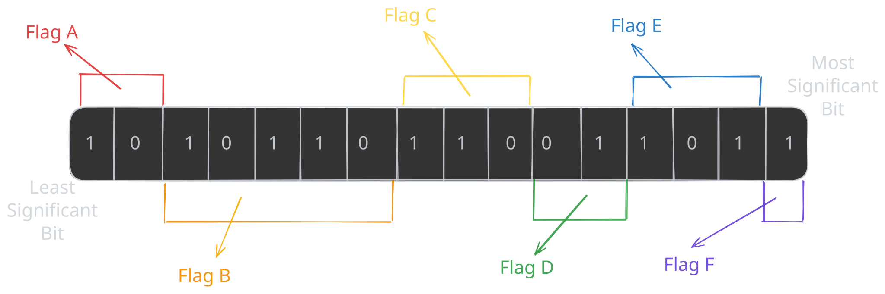
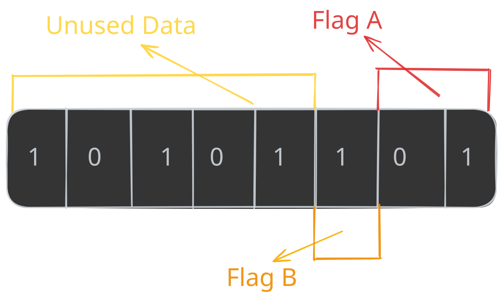
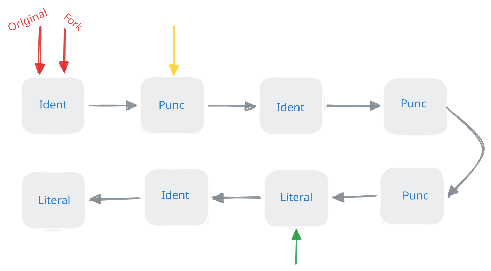

# Writing the Bitflags Macro

As you may recall from the previous chapter, we used a proc-macro that was called `bitfields`. In this chapter, we are going to learn about Rusts proceadural macros, and even implement this macro ourselves.

> Another great resource for this subject is the great video [Comprehending Proc Macros](https://youtu.be/SMCRQj9Hbx8?si=p-JUX0rLronBG_Nz) by Logan Smith


_If you are familer with procedural macros, `syn` and `quote`, and want to go straight to the macro implementation, click [here](#defining-our-macro)_

## A Little Introduction to Proceadural Macros

Macros are not a new idea in programming languages, and most of them have macros in some shape or form. But what even is a macro?

If you ask wikipidia, we get the following definition. 
### [_Macro_](https://en.wikipedia.org/wiki/Macro_(computer_science))
<div style="border-left: 3px solid #ccc; padding-left: 12px;">

_A macro is a rule or pattern that specifies how a certain input should be mapped to a replacement output._

</div>

When I read this definition, the first thing that comes to mind, is that it really sounds like a function. After all, a function maps the input argument, to the output arguments, Which is exactly what a macro does. And that is exactly right, in Rust, macros (specifically proceadural macros), are indeed a specific type of functions, but lets not get ahead of ourselves.

The key differences between macros and regular functions is that macros _replace_ the inputs and the outputs, and that is not always true with functions. Secondly, macros operate on our source code instead of variables in our program.

Rust takes this definition very literally, and the definition for a proc-macro function looks like this: 

```rust
#![function!("snippets/src/lib.rs", custom_proc_macro)]
```

As you can see in this function, the input is Rusts `TokenStream` which is literally our source code, and the output is also a `TokenStream` which means it expects us to return also source code which could be the same (Like the example above), but most of the time it is not.

But what is this `TokenStream`, why not to just use strings of the source code?

Well, the main reason we are even discussing this, is that we want to manipulate the initial code in some way. Tokenizing the source code allows us to manipulate the code at a higher level which is easier to reason about. This `TokenStream` is the most basic tokenization unit that we are going to work with, and it contains a sequence of `TokenTree` nodes that represent the source code.

```rust
#![enum!("<rustc>/lib/rustlib/src/rust/library/proc_macro/src/lib.rs", TokenTree)]
```

To see this more visibly, we can print our TokenStream, because it implement the `Debug` trait. Which for a simple struct would look like this: 

```text
TokenStream [
    Ident {
        ident: "struct",
        span: #0 bytes(43..49),
    },
    Ident {
        ident: "Example",
        span: #0 bytes(50..57),
    },
    Group {
        delimiter: Brace,
        stream: TokenStream [
            Ident {
                ident: "a",
                span: #0 bytes(64..65),
            },
            Punct {
                ch: ':',
                spacing: Alone,
                span: #0 bytes(65..66),
            },
            Ident {
                ident: "i32",
                span: #0 bytes(67..70),
            },
            Punct {
                ch: ',',
                spacing: Alone,
                span: #0 bytes(70..71),
            },
        ],
        span: #0 bytes(58..73),
    },
]
```

_Can you understand what is the name of the struct and its fields?_

## How Macros are Executed

As you may have noticed, macros does not behave exactly like regular functions. Another difference that they have is that they are evaluated at compile time. 

This thinking can also be used on regular functions, but not from our point of view, but from the compilers. For the compiler, regular functions are also a mapping, from some target language (in our case, Rust) to some other target language (in most cases, ASM[^1]).

For example, this function: 

```rust
#![function!("snippets/src/book/ch02_03/general.rs", square)]
```

would map to the following ASM code:

> [!TIP]
> Look it yourself at [compiler explorer](https://godbolt.org/z/7vTzbs6e9)

```x86asm,icon=@https://icons.veryicon.com/png/o/business/vscode-program-item-icon/assembly-7.png
square:
  mov     eax, edi
  imul    eax, edi
  ret
```

From this point of view, macros are not so different, but instead of a target language, they are mapped to the same language.
So this macro:

```rust
#![source_file!("snippets/src/book/ch02_03/general.rs", 8:12)]

#![function!("snippets/src/book/ch02_03/general.rs", foo)]
```

Would map to this literal Rust code:

```rust
#![function!("snippets/src/book/ch02_03/general.rs", foo_expanded)]
```

The fact that macros operate on our source code, means that we can abstract certain logics, that regular functions cannot. For example, take a look at this macro:

```rust
#![source_file!("snippets/src/book/ch02_03/general.rs", 24:31)]
#![function!("snippets/src/book/ch02_03/general.rs", main)]
```

It works, because it injects the `break` expression into the code at the call site, which is something that a function just can't do.

```rust
#![function!("snippets/src/book/ch02_03/general.rs", unwrap_or_break)]
```

At this time, I hope you understand the great power of macros, and the great [code generation](https://en.wikipedia.org/wiki/Code_generation) capabilities that they enable. But, you might think rightfully think that in the examples above, we didn't have the option to insert 'coding' logic into the macro expansion. This is where procedural macros come in.

[^1]: This is actually a simplified view, compilers have intermediate representations. These representations are really useful but out of the scope of this book. If you are like me, and this really interests you, I will drop a great blog post which gives an example of why the intermediate representations are useful. [From Rust to Reality: The Hidden Journey of fetch_max](https://questdb.com/blog/rust-fetch-max-compiler-journey/)

## Macro Types

Just before we dive into procedural macros, lets cover up the type of macro that we already used in the examples above.

> All the syntax information about how macros are structured are taken directly from the [Official Rust Reference](https://doc.rust-lang.org/reference/macros.html).

### Declarative Macros

Declarative macros are the simplest type of macro, and they are the ones that we used in the examples above. They are mainly used to generate mainly simple syntax extensions, which are commonly called "macros by example".

Each macro is defined by a set of rules that specify how the macro should expand. Each rule looks a bit like a function signature that can get certain `Metavariables`. These `Metavariables` are placeholders for certain Rust syntax that are replaced with actual values when the macro is expanded.

Lets analyze the syntax of a declarative macro rule from the earlier examples.

```rust
#![source_file!("snippets/src/book/ch02_03/general.rs", 51:65)]
```

We will go a bit deeper then necessary on the common types of metavariables that are available. This is because later in this chapter we are going to talk about the `syn` library, which will parse Rusts syntax into similar structures.

Each metavariable starts with a `$` followed by the name of the metavariable which is used to refer to it. Then it is followed by a colon and the type of the metavariable.

The common types of metavariables are:

1. **Idents ($i:ident)** => These can be function names, variable names, type names, etc. They also include keywords like `fn`, `let`, `struct`, etc.
2. **Expressions ($e:expr)** => Expressions are things that are evaluated to a value, like `1 + 2` or `foo.bar()`.
3. **Items ($i:item)** => Items are the components of a module, for example the entire definition of a function or a struct.
4. **Statements ($s:stmt)** => Statements are the individual lines of code that make up a function or block. For example `let x = 42;` is a statement.
5. **Blocks ($b:block)** => Blocks are groups of statements that are executed on the same scope. For example `{ let y = 33; let x = 7 + y; x }` is a block.

_For a full list of available metavariable types, see the [reference](https://doc.rust-lang.org/reference/macros-by-example.html#r-macro.decl.meta.specifier)_


### Procedural Macros

Now for the real deal. Proceadural macros gives us the ability to go beyond simple syntax extensions, and allow us to write custom Rust code that will run on compile time on the macro input to consume and produce new Rust syntax (Depending on the macro type, the returned syntax will replace the input syntax, or will be added to it).

Because procedural macros are another piece of code that will run at compile time, they cannot be defined in the same crate as the code that uses them. This is because the Rust compiler must initially compile the code of the macro so it will be able to run it during the compilation process. In addition, each proc macro crate, must add the following configuration to their `Cargo.toml` file, which will tell Cargo that this is a proc macro crate.

```toml
[lib]
proc-macro = true
```

As all function, these macro functions can also fail, although these functions are allowed to panic. They are encouraged to use the `compile_error!` macro to return a compile time error instead, which is the compiler form of `panic!`

To gain the `Tokenstream` type and the attributes that will be used on the macro functions, we need will use the `proc_macro` crate which is automatically linked to our crate if it is a proc macro crate.

### `function_like!()`

function like macros are very similar to declarative macros. They are invoked like a regular function and take a `TokenStream` as input and return a `TokenStream` as output.

This type of macro can be called anywhere in our code, even in global scope and is defined using the following syntax:

```rust
#![function!("snippets/src/lib.rs", foo)]
```

Then it can be called like a regular function, which will create a function that is called `bar` which could be used in our code.

```rust
#![source_file!("snippets/src/book/ch02_03/invoke.rs", 1:99)]
```

_This type of macro replaces the macro invocation with the generated code, so the macro invocation is effectively replaced with the generated code._

### `#[derive(CustomDerive)]`

Derive macros are used on On Rust items to generate code automatically. They are invoked using the `#[derive]` attribute and take the item they are applied to as input. Most of the time, derive macros are used to implement traits such as `Debug`, `Clone`, `PartialEq`, etc.

Derives may also include helper attributes, which are used to customize the generated code. 

This type of macro can be called only from structs, enums or unions.

```rust
#![function!("snippets/src/lib.rs", derive_with_helper_attr)]
```

And is used on a structure like this: 

```rust
#![struct!("snippets/src/book/ch02_03/general.rs", Foo)]
```

_This type of macro does not replace the macro invocation or the input item with the generated code, and the generated TokenStream is appended to the input TokenStream._

### `#[attribute(macros)]`

Attributes are used to annotate items with. They are placed before the item they are applied to and are used to customize the behavior of the item.

Attributes may also include input variables, which can be used to pass 'configuration' to the macro.

```rust
#![function!("snippets/src/lib.rs", return_as_is)]
```

And is used on a structure like this:

```rust
#![struct!("snippets/src/book/ch02_03/general.rs", Bar)]
#![function!("snippets/src/book/ch02_03/general.rs", bar)]
```

_This type of macro replaces the macro invocation and the input item with the generated code._

## Introduction to Syn and Quote

Remembering our goal to write the `bitfield` macro from earlier chapter, you can already guess that we want to write an `attribute` macro. But, parsing the TokenStream we saw above is really hard, because it will require us to understand Rusts syntax tree, which can be quite complex.

Luckyly for us, the `syn` crate, written by `David Tolnay` provides a way to parse Rust syntax tree into a structured AST (Abstract Syntax Tree), which makes it easier to work with Rust source code.

### What are Abstract Syntax Trees
 
As the name suggests, this a tree like structure, that represents the syntax of a certain programming language (in our case, Rust).
Before diving right into the implementation of `syn` on Rust syntax, let's first understand what an AST is. 

We will look at a really simple program, that is writing in Python.

```python
current = 0
for item in items:
    if item > current:
        current = item
```

A simplified syntax tree for a simple program like this might look like this:

<figure style="margin: 0; text-align: center">
  
  <figcaption><strong>Figure 3-1: </strong>simplified syntax tree</figcaption>
</figure>

As you can see, in a tree like this we can have types that help us represent the syntax in our language. For example the `Assign` statement which contains a `left` and `right` side. Or the `For` loop which contains item that is being iterated over, the collection name, and the body of the loop. Then, when we want to operate on the syntax it self, for example, create the same if statement, but change the name of the item. We can simply copy the type, and change the item ident to a new one.

As you may have gussed, `syn` does the exact same thing we did with our small program, but with all the complexity of a real language. So lets see what types does it offer.

_There are a lot of types on the `syn` crate, and we will only cover some of them. Once you get the hang of it, all the other will be easy to understand._

The top level type for the AST is `syn::File`, which represents a complete Rust source file.

```rust
#![source_file!("<crateio>/syn-2.0.117/src/file.rs", 6:86)]
```

Ok, we can see that `syn::File` is made out of a list of `syn::Attribute` and `syn::Item`. But this doesn't tell us much, so let's also explore them.

```rust
#![source_file!("<crateio>/syn-2.0.117/src/attr.rs", 23:183)]
```

So we can see an attribute, like `#[derive(Debug)]`, is represented by `syn::Attribute`. Currently, we will not dive deeper into `Attribute` but we will cover more of it, when we will use it in our macro implementation.

Now let's see `syn::Item`.

```rust
#![source_file!("<crateio>/syn-2.0.117/src/item.rs", 22:101)]
```

As you can see, we have a lot of items, and I hope that you can start and recognize some of them, as an example, let's cover `ItemConst`.

```rust
#![source_file!("<crateio>/syn-2.0.117/src/item.rs", 103:118)]
```

If you have noticed closely, the order of the fields in the struct definition is the same as the order in the source code. This makes it really easy to map the AST back to the source code.

Also, as a side note, keywords like `const`, `struct` and punctuation like `:` and `=` does have types, but `syn` also provides a `Token!` macro that maps the literal token to its corresponding type.

The last type that we are going to cover is `syn::Expr`, which represents an expression from the source code. Because most of Rusts syntax is represented as expressions, `syn::Expr` is a very large type.

```rust
#![source_file!("<crateio>/syn-2.0.117/src/expr.rs", 37:269)]
```

These types are very powerful, and help us express the language is a structured way. As a quick example, let's see how `syn::ItemStruct` is represented in the AST. In this example, we have the exact same struct, that we showed its `TokenStream` representation.

```
ItemStruct {
    attrs: [],
    vis: Visibility::Inherited,
    struct_token: Struct,
    ident: Ident {
        ident: "Example",
        span: #0 bytes(50..57),
    },
    generics: Generics {
        lt_token: None,
        params: [],
        gt_token: None,
        where_clause: None,
    },
    fields: Fields::Named {
        brace_token: Brace,
        named: [
            Field {
                attrs: [],
                vis: Visibility::Inherited,
                mutability: FieldMutability::None,
                ident: Some(
                    Ident {
                        ident: "a",
                        span: #0 bytes(64..65),
                    },
                ),
                colon_token: Some(
                    Colon,
                ),
                ty: Type::Path {
                    qself: None,
                    path: Path {
                        leading_colon: None,
                        segments: [
                            PathSegment {
                                ident: Ident {
                                    ident: "i32",
                                    span: #0 bytes(67..70),
                                },
                                arguments: PathArguments::None,
                            },
                        ],
                    },
                },
            },
            Comma,
        ],
    },
    semi_token: None,
}
```
_Can you see the name of the struct, and the type of the field in the AST?_

As you can see, what was before a list of punctionations, and idents, now have become a structured representation that is easier to work with. 

The most important thing about syn, is that we can use the types that if offers, to create new, custom types, that are not bounded to the language's AST. 

But how would syn know to parse our custom syntax into the AST types it offers? This is where the `Parse` trait comes in. When syn wants to parse our custom syntax, it will call the `parse` method from the `Parse` trait, and pass in the token stream to parse.

```rust
#![trait!("<crateio>/syn-2.0.117/src/parse.rs", Parse)]
```

We will go deepr into this, when we will create our own custom `Parse` implementation. One important thing to understand is that all of syn's types implement `Parse` themselves, so most of the time, implementing `Parse` for types that are built from syn's AST types is easy.

Up until now, we learned how to parse our source code, into a meaningful AST representation. This representation will help us to work with the syntax, and to implement our macro's logic. But, after we parsed the source code, and processed it to our needs, we need to return it back into a `TokenStream`. This is where the `quote` crate comes in.

Quoting is a term that is borrowed from lisp, and it means that we write things that looks like code, but they will actually convert into a data under the hood, or in our case the `TokenStream` type.

The `quote` crate provides a `quote!` macro that allows us to write quoted expressions.

For example, let's define a simple quoted expression that represents a struct definition:

```rust
#![source_file!("snippets/src/book/ch02_03/general.rs", 81:90)]
```

As you can see, it seems like we write Rust code, but actually under the hood, it is converted into a `TokenStream`.

Another great quality that this macro have, is that it supports entering variables into the quoted expression. Let's look at an example, where we change a name of a function, inside an attribute macro.

```rust
#![function!("snippets/src/lib.rs", change_name)]
```

As you can see, we parsed the input with `syn` into a function item. Then, we changed the name of the function, and transferred it to the `quote!` macro with the `#` so that it would convert the variable into a `TokenStream`.

But how quote knows to convert the variable into a `TokenStream`? This is where the `ToTokens` trait comes in.

```rust
#![trait!("<crateio>/quote-1.0.45/src/to_tokens.rs", ToTokens)]
```

In this trait, the `to_tokens` method is defined, which gets a `&mut TokenStream` and appends the tokenized representation of the variable to it.

The types that are defined in `syn` already implement this trait, so they can be used with `quote!` without any additional work like in the example above that the `ItemFn` became a function definition.

## Defining our Macro 

In my opinion, the most important thing to do before we even start to code (even not specifically for macros), is to the define what we want from our program.

The main thing we wanted in the first place, is to represent a number, e.g u8, u16, u32 etc, as flags. To see a clear example look at the drawing below.

<figure style="margin: 0; text-align: center">
  
  <figcaption><strong>Figure 3-1: </strong>bitflag struct example</figcaption>
</figure>


In this drawing we can see six different flags. Each takes a different part inside our u16 number. 
1. Flag A is between bits 00-02
2. Flag B is between bits 02-07
3. Flag C is between bits 07-10
4. Flag D is between bits 10-12
5. Flag E is between bits 12-15
6. Flag F is between bits 15-16

For each flag, we would like to have multiple functions. 

- A getter, which return the value of the flag.
- A setter, which sets the the value of the flag.
- Clear function, which written a clear value if defined directly to the flag. (Will be necessary in the future)

Because we need multiple functions defined, the best Rust item suited for the job is a `struct`. Also, because a struct will wrap the entire definition, the macro will have in it's context all of the definitions of all the flags, which means we could also implement the `Debug` trait on it to print all of the flags.

Some flags will need different functions, and may also have `types`. For example think about the protection level field in the previous section. While we can just leave it as a number, most of the time, it is more convenient to have an enum, that represents the valid values. Also, some flags may not need all the functionalities of get, set and clear. For that, we want to have the ability to control which functions will be generated.

And for the last caveat, some flags will be written as absolute values on their setter function, and will return absolute value on their getter. What does that mean? Take as an example flag `E` on the example above. The span of this flag is between bits 12-15. In most of our flag cases, we would want to write to this value numbers between the 0-7, because it is 3 bits wide. When we will set the don't shift attribute, we would want absolute value for this flag, which means the lowest value (besides from 0) will be `1 << 12` (The first bit of the flag) and highest value will be `1 << 14` where the jumps between each value will be `1 << 12`

This design for this macro, with inspiration from [Proceadural Macro Workshop](https://github.com/dtolnay/proc-macro-workshop#attribute-macro-bitfield) will be a regular Rust struct, with helper attributes.

For example, this struct will represent the flags in the example above (with example helper attributes).

```rust
#![struct!("snippets/src/book/ch02_03/general.rs", MyFlags)]
```

## Implementing the Macro

### Sketching the Idea

The first thing that I like to do when creating a macro, is to create a simple input for the macro, and generate the key functions output by hand.
This way, I could have a mental model of what is suppose to do, and I can generalize on that.

So, for starters, let's create a really simple input and output for our macro.

```rust
#![struct!("snippets/src/book/ch02_03/general.rs", SimpleFlags)]
```

Just before we are creating our functions, what will our struct type will be? In this case we have a two bit field and a one bit field, but there is no type that is three bits wide. Instead, we are going to pick the closest uint type that is large enough to hold our fields. In this case a u8.

```rust
#![struct!("snippets/src/book/ch02_03/general.rs", SimpleFlagsType)]
```

Now for our functions. The problem that we need to solve, is how to get and set the value of the bits, that are stored in the underlying `u8` field.

_This part assumes familiarity with bitwise operations like right and left shifts, and simple gates like AND, OR and NOT. For those of you who are not familiar with these operations, I really recommend the seeing this [video](https://www.youtube.com/watch?v=vqpfrSIyojo) by BitLemon._.

<figure style="margin: 0; text-align: center">
  
  <figcaption><strong>figure 3-2: </strong>simpleflags layout</figcaption>
</figure>

We will start with reading the value for the `b` flag. There are multiple combinations of bitwise operations that can achieve this. The one that we will use is to first, zero out the entire content of the `u8` except from our `b` flag, and then shift it to the right to the right and read it.

So first, let's think about how can we zero out the entire content of the `u8` except from our `b` flag. We can do this by using the `&` operator to perform a bitwise AND operation between our `u8` value and a mask[^2] that has all bits set to 0 except from our `b` flag which will be all 1s. By hand, this mask will look like this `0b00000100`. But this ofcourse does not help us much, because we need to automatically generate this mask for each bitfield and it may also have multiple 1 bits, and not only one, like in this case. 

To generate this mask, we will think of a much simpler case, how can we put a sequence of ones at the start of our mask? Before I will give the answer, let's think what a sequence of ones means. A sequence of ones is always a number, that when we will add 1 to it, will become a perfect power of 2 on the bit after the sequence. For example `0b00000111` (7) will become `0b00001000` (8) when we add 1 to it.

You may have also noticed that the number of bits that were set to 1 before we added 1 is equal to the power of 2 of the number after we added 1. For example `0b00000111` (7) has 3 bits set to 1, and 8 is exactly `2^3`. 

> [!TIP]
> If I were you I wouldn't accept this fact, go try it for yourself with more examples to see that it is true

To generally create a mask with the first `n` bits set, we can use our formula: `2^n - 1`. Because we are speaking only on powers of two, we will use `(1 << n) - 1` to create the mask. Which is the same thing.

[^2]: The sequence of bits that will be used along our value in a logic gate.

```rust,playground
#![function!("snippets/src/book/ch02_03/mask.rs", generate_mask_1)]

#![function!("snippets/src/book/ch02_03/mask.rs", main)]
```

If played with this example in the demo, you may have found, that in one perticualr case this formula does not work as expected. (If you didn't find it, I urge you to try it yourself).

When our `(1 << n) - 1` will result in an all 1, it means that `1 << n` was bigger then our underlying type. For example, `(1 << 8) - 1` which should generate the `0b11111111` mask, will instead generate `0`, because `1 << 8` is `256`, which is bigger then `u8` can hold. While we can use bigger types, for the maximum size type, it will not work.

The alternative method that we are going to use is instead of increasing the number of 1 bits in our mask each time, and starting from 0, we are going to start with an all 1 mask, and reduce the number of 1 bits each time. This won't have the gap at an all 1 mask, because it is the starting value.

To achieve it, we are going to start with our type maximum mask, and then shift it to the right by the total number of bits in our type, minus our width. For example, if our type is `u8`, and our width is `3`, our mask will be `0b11111111 >> (8 - 3) = 0b00000111`. 

```rust,playground
#![function!("snippets/src/book/ch02_03/mask.rs", generate_mask_2)]

#![function!("snippets/src/book/ch02_03/mask.rs", main)]
```


The next thing that we are going to do, is to relocate the position of the bits in our mask to the flag position in our u8.

This could easily be done using the left shift operator `<<` with the offset of our flag. For example, if the starting bit of our flag is at position 2, we can shift our mask to the left by 2 bits: `mask << 2`. Which makes our final mask generation function look like this:

```rust,playground
#![function!("snippets/src/book/ch02_03/mask.rs", generate_mask_3)]

#![function!("snippets/src/book/ch02_03/mask.rs", main)]
```

The to read the value, we just need to apply an AND gate with the mask, and then shift the result to the right by the offset to normalize it.

```rust,playground
#![function!("snippets/src/book/ch02_03/mask.rs", generate_mask_3)]

#![function!("snippets/src/book/ch02_03/read.rs", read_flag)]

#![function!("snippets/src/book/ch02_03/read.rs", main)]
```

To write to our value, you may be tempted to use the left shift operation on the new value to put it in the correct position and then OR it with the original value. While your intuition is good, this approach will not work. This is because the OR gate only change bits from 0 to 1, but cannot change bits from 1 to 0. So our approach will be to first clear the bits we want to change, and then OR it with the new value.

To clear the flag, we can use and gate, where all the flag bits are set to 1, and the rest are 0. This will leave the flag bits unchanged, and the rest will be cleared. So our clear mask looks like this `0b11111011`.

You may have notice that this is the exact inverse of the mask we used to read the flag. So we will use the same approach to generate it, and use the NOT gate with the `!` operator to invert all the bits. After that, we can OR it with the new value shifted to the correct position.

```rust,playground
#![function!("snippets/src/book/ch02_03/mask.rs", generate_mask_3)]

#![function!("snippets/src/book/ch02_03/write.rs", write_flag)]

#![function!("snippets/src/book/ch02_03/write.rs", main)]
```

### Struct Definition

When starting to implement any piece of code, it is always a good idea to first sketch out the types that we are going to use.

Borrowing again the definition of our macro, these are the types that come to mind.

```
#[bitfields]
struct MyFlags {
  #[flag(r)]
  a: B2,
  b: B5,
  #[flag(rwc(30))]
  c: B3,
  #[flag(flag_type = ProtectionLevel)]
  d: B2,
  #[flag(r, dont_shift)]
  e: B3,
  f: B1,
}
```

- BitFields
  - FlagAttribute (i.e `#[flag(r, dont_shift, flag_type = ProtectionLevel)]`)
    - Permissions
    - FlagType
    - DontShift
  - Single Bitfield (i.e `a: B2`)
    - FlagMeta (i.e `width: 2, type: u8`) 

### FlagAttributes

Our `FlagAttribute` struct will simply store the permissions, flag type, and `dont_shift` flag of a flag.

```rust
#![struct!("crates/macros/src/bitfields/flag_attr.rs", FlagAttribute)]
```

#### Permissions

For our permission attribute, we want to store if it has read, write or clear, and the clear value. You may be tempted to use one number here and encode it in the bits of it to have good performance on it. But, this will not be a good idea because macros are expanded at compile time, and the expansion between compilations are cached. So the performance increase doesn't really matter.

```rust
#![struct!("crates/macros/src/bitfields/flag_attr.rs", FlagPermission)]
#![trait_impl!("crates/macros/src/bitfields/flag_attr.rs", Default for FlagPermission)]
```

#### DontShift

For some of our flags, and especially the `dont_shift` flag, we want to parse custom idents, in this example the literal `dont_shift` keyword.

Instead of parsing ident's by our own logic, `syn` provides a cool `custom_keyword!` macro that allows us to parse custom idents easily.

```rust
#![source_file!("crates/macros/src/bitfields/flag_attr.rs", 6:11)]
```
#### FlagType

For our final type on the attribute, we want to parse the sequence `flag_type = some_type`. To represent this, we will use the following struct.

For our type, we will use syn's [`TypePath`](https://docs.rs/syn/latest/syn/struct.TypePath.html) struct, which represents a path to a type, such as `std::ffi::CString`.

```rust
#![struct!("crates/macros/src/bitfields/flag_attr.rs", FlagType)]
```

### Single Bitfield

For single field, we would want to include our attribute we just defined, the comments, visibility and name of the field to use on the generated functions, and the size and offset of the field, for our read and write functions.

```rust
#![struct!("crates/macros/src/bitfields/bitfield.rs", BitField)]
```

> [!NOTE]
> We use references on some of the fields because this structure will be created from the [`syn::Field`](https://docs.rs/syn/latest/syn/struct.Field.html) struct, so instead of cloning the values, we use references to avoid unnecessary allocations.


#### FlagMeta

For our `FlagMeta` struct, we will want to store the width of the field, but also the type that will represent it. So `B3` would have width `3` and type `u8`.

```rust
#![struct!("crates/macros/src/bitfields/utils.rs", FlagMeta)]
```

### Parsing the Attribute

We will start off easy, by parsing the `FlagType` attribute. Because every element in this attribute already implements the `Parse` trait, we can call it's parse function in the correct order.

```rust
#![trait_impl!("crates/macros/src/bitfields/flag_attr.rs", Parse for FlagType)]
```

If you were wandering why are we calling the `parse` function on the input instead of on the type itself. It is because the `ParseStream` implements this very convenient `parse` function that allows us to parse a single token of from the stream at a time.

```rust
#![impl_method!("<crateio>/syn-2.0.117/src/parse.rs", ParseBuffer::parse)]
```

Next, let's parse something that takes a little more effort, our `FlagPermission`.

```rust
#![trait_impl!("crates/macros/src/bitfields/flag_attr.rs", Parse for FlagPermission)]
```

For the `dont_shift` keyword, the parsing is implemented automatically because we used the `custom_keyword!` macro to define it.

And now for the parsing of the entire attribute. While we can define a strict order for the attribute, and then call parse on each field. We will not do that because it will be annoying to use the macro. Instead we will `fork` the stream and try to parse it as each of our fields. If the parsing will succeed, we will save the parsed item, and keep forking and parsing until we reach the end of the stream.

But what is forking? and why do we need it?

Imagine our stream as a really large linked list, that contains all of our tokens. When we parse the stream, we are moving our position through the list by `consuming` the tokens as we parse them. The problem with what we are trying to do, is that if we start parsing an item, and it fails, by we already parsed some of the tokens of the item, we have no way of coming back to the exact position we were at before the failure.

This is where forking comes in. When we fork the stream, we create another pointer to the position on the list, which is independent from the original position we had. Then, we can try and parse the stream with the fork. If it fails, we can simply discard the fork, and if it succeeds, we can advance the original position to the fork's position.

<figure style="margin: 0; text-align: center">
  
  <figcaption><strong>figure 3-3: </strong>parse stream with fork</figcaption>
</figure>

The last thing we want to keep in mind, is that we want to avoid duplicates in our attributes. So we will keep for each attribute a variable that stores if we already seen that attribute before.

```rust
#![trait_impl!("crates/macros/src/bitfields/flag_attr.rs", Parse for FlagAttribute)]
```

And now for the `try_parse` function, where we basically want to fork the stream and try to parse the item, if we succeed, we advance the original position to the fork's position, otherwise we discard the fork and increment the error_counter.

```rust
#![function!("crates/macros/src/bitfields/flag_attr.rs", try_parse)]
```

Although we implemented `Parse` for `FlagAttribute`, we are not going to create it from raw tokens. Because, if you noticed, we only parsed the inside of the attribute, but not the `#[flag()]` part.
For that we are going to use the `Meta` part of our `syn::Attribute`.

```rust
#![source_file!("<crateio>/syn-2.0.117/src/attr.rs", 455:486)]
```

In our case, we are going to have a `Meta::List`, which contains a `TokenStream` of the attribute's contents, hence the implementation of the `Parse` trait.

```rust
#![trait_impl!("crates/macros/src/bitfields/flag_attr.rs", TryFrom for FlagAttribute)]
```

### Parsing the Struct

Instead of parsing the struct directly, we will instead parse a regular `syn::ItemStruct` and then implement the `TryFrom` trait to convert between types in the regular `syn::ItemStruct` and our custom `BitFields` type.

Again, we will start of easy, by converting the type of the struct field into our custom `FlagMeta` type.

```rust
#![trait_impl!("crates/macros/src/bitfields/utils.rs", TryFrom for FlagMeta)]
```

To turn the width number of the type to the type that will represent it, we will use the following function.

```rust
#![function!("crates/macros/src/bitfields/utils.rs", type_from_size)]
```

For each field on our struct, we are going to initially extract all the attributes on it and divide them into document attributes and our flag attributes.

This can be easily done, because Rust doesn't store our comments as a string starting with `///` but as a `#[doc(some_comment)]` attribute. This makes our comments actually a `syn::Attribute` token which we already know how to work with.

```rust
#![function!("crates/macros/src/bitfields/bitfield.rs", extract_attributes)]
```

After that, we are going to create our field from the `syn::Field` token. But, the field itself is not enough, because from it we can't known the offset of the field in the struct. We are going to give as a parameter in the `new` function that will create our `BitField` instance. We can do that because when we will create our fields one by one, we will add each time their size to an offset, that will ofcourse start at 0.

```rust
#![impl_method!("crates/macros/src/bitfields/bitfield.rs", BitField::new)]
```

Finally, after all that parsing, we can turn the parsed `syn::ItemStruct` into our `BitFields` instance. 

```rust
#![trait_impl!("crates/macros/src/bitfields.rs", TryFrom for BitFields)]
```

## Generating the Code

With all of our types set up, we can now generate the code for our functions from them.

Our first function will be a utility function, that will provide us some checks on our input value. This check will be used to check that the input value is within the valid range for the field, and it will be guarded by a `debug_assert!` macro, so in release builds it will be optimized out.

```rust
#![impl_method!("crates/macros/src/bitfields.rs", BitFields::checks)]
```

For each of our functions, we are going to use three main types. The first is the type of the variable that we are getting, the second, is going to be the type that represents the type of the variable we are getting, and the third is the type of the entire struct. For example, we might have a field `#[flag(flag_type = Bar)] foo: B6`. The type of our variable in this case will be `Bar`, the type that represents the field is `u8` because it is only 6 bits wide, and the type of the entire struct depends also on the other fields and their sizes, but it will also follow the rules of the `type_from_size` function.

To store all of these types we are going to use a struct.

```rust
#![struct!("crates/macros/src/bitfields.rs", FieldTypes)]
```

Then, to create it from our field, so it can be used in other functions, we are going to use the following function.

```rust
#![impl_method!("crates/macros/src/bitfields.rs", BitFields::field_types)]
```

Without further diving into our utility functions, let's look on our read function.

```rust
#![impl_method!("crates/macros/src/bitfields.rs", BitFields::fn_read)]
```

As explained above, the first thing we do, is to extract the types that we are going to use inside this function. Then, we are going to get the function name, for the rest of our functions, we are not going to have a function like this, but for the read function, I personally wanted for my convenienve that if the type of the item was `bool` so that it would change to `is_<flag_name>` instead of `get_<flag_name>`

```rust
#![impl_method!("crates/macros/src/bitfields.rs", BitFields::read_fn_name)]
```

For our `read_shift` function we need to know if to shift the value or not per the `dont_shift` attribute, and in which direction. For write operations we need a left shift, to change from the the absolute value we get the it's relative value on the flag, and for read operations we need a right shift, to convert from the relative value on the flag to it's absolute value. When the `dont_shift` attribute is present, we don't need any of this, because the values are always absoluteo.

```rust
#![impl_method!("crates/macros/src/bitfields.rs", BitFields::read_shift, write_shift)]
```


> [!IMPORTANT]
> You may have noticed that when we use functions from the `core` library, I am refrening them as `::core` with a leading `::`. And that for example when I use the `try_from` method from the `TryFrom` trait, I call the trait function with the object instead of `object.try_from(T)`
>
> When writing a macro, we don't want to insert `use` statement to the codebase of the person that is using our macros, and, we can't assume (although most of the time unlikely) that he or she didn't implement functions with similar names as in our example `try_into`, that are doing an entirely different thing.
>
> Because of that, the safest when to to call functions from libaraies, and trait methods, is to use their fully qualified name. So we use `::` before core, to refenrece the compiler's core library (in case they have a core.rs module) and the fully trait name to call it's functions.

When implementing our write and clear functions, we are going to use almost the exact same code for the writing logic. Because of that, we are going to extract this piece of code to a general `volatile_write` function.

```rust
#![impl_method!("crates/macros/src/bitfields.rs", BitFields::volatile_write)]
```

Which makes this our write function.

```rust
#![impl_method!("crates/macros/src/bitfields.rs", BitFields::fn_write)]
```

Our `v_to_repr` function will be used to convert our value `v` from the type of the flag, to it's representation type by using the `try_from` function.

```rust
#![impl_method!("crates/macros/src/bitfields.rs", BitFields::v_to_repr)]
```

Therefore, we can use this value `v` that it defines in the `volatile_write` function, because it can `as` cast into the struct type.

For the final function, which is our clear function, we are going to use the same logic as the write function, but instead of operating on a value `v`, we are going to operate on the clear value, which is already a usize.

```rust
#![impl_method!("crates/macros/src/bitfields.rs", BitFields::fn_clear)]
```

As a little bonus function, that is mainly used for convenience, we will create a build function, that is meant to operate on an empty struct, and define multiple flags on it's creation (e.g `let flags = Flags::new().flag1(2).flag2(3)`).

```rust
#![impl_method!("crates/macros/src/bitfields.rs", BitFields::fn_build)]
```

Because we know we are operating on an empty flag, instead of clearing the flag and then writing, we can simply use the OR gate to write our value, because we know nothing is set in the flag yet.

The last things that we want to generate is the `Debug` trait implementation, and the `From` trait from the flags into the struct repr, and from the struct repr into the flags.

The latter is really easy, to trasnalte into the underlying type, we just return the inner type. And to construct from the inner type, we simply call the constructor.

```rust
#![impl_method!("crates/macros/src/bitfields.rs", BitFields::conversion_impls)]
```

To implement the `Debug` trait, we need to first create the formatter debug struct builder, and then add each of our fields to it.
Because we can have multiple fields, we need to insert some sort of repetition. Luckily, the `quote!` macro provides us a way to do it.
If we have a vector, or an iterator, of things that implement `ToTokens`, we can insert them all using the `#(#..)` syntax. 

```rust
#![impl_method!("crates/macros/src/bitfields.rs", BitFields::debug_impl)]
```

> [!WARNING]
> The debug trait implementation makes our binary larger, and adds additional compilation time. In the correct version of the macro, the `Debug` trait implementation is not guarded by a feature, but in the future it will be generated only if the main struct will include `#[derive(Debug)]`.
> As a cool exercise, you can try to add that feature to the macro yourself.

And for the grand finale, the implementation of the `ToTokens` trait for our macro.

```rust
#![trait_impl!("crates/macros/src/bitfields.rs", ToTokens for BitFields)]
```

And for the macro itself, we need to parse a struct from the input, and convert it into a `BitFields` struct. Then just turn it into tokens or raise the error in parsing, depending on the result.

```rust
#![function!("crates/macros/src/lib.rs", bitfields)]
```
