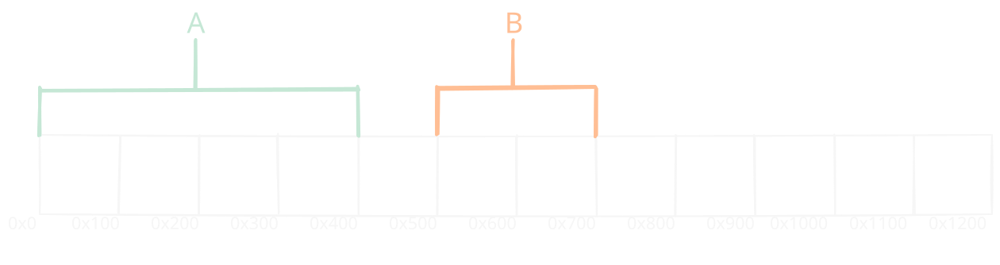
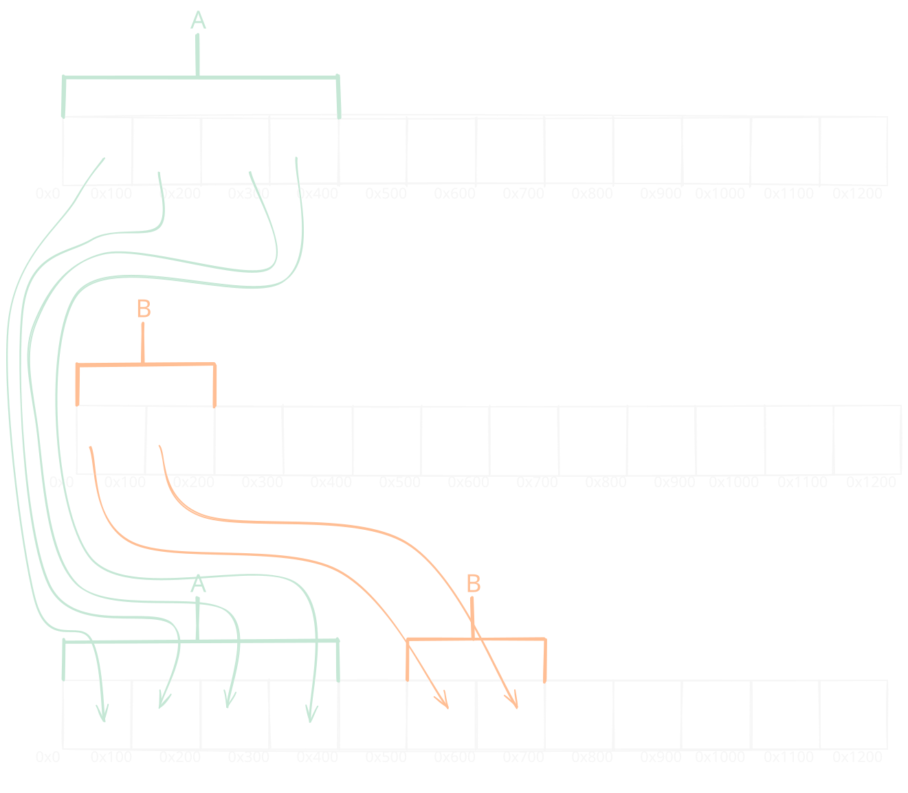
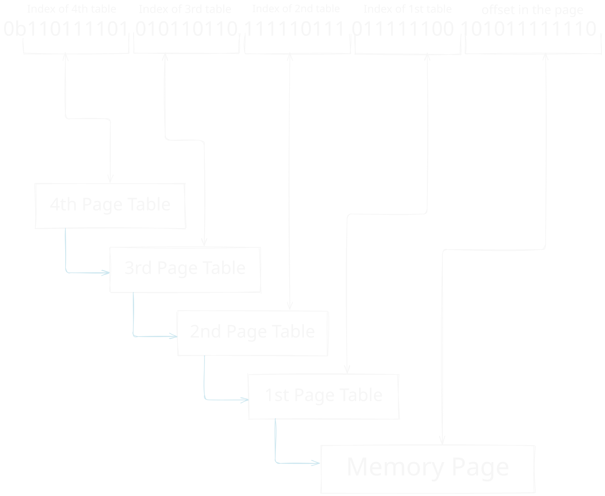

# What is Memory Paging?

_"The purpose of abstraction is not to be vague, but to create a new semantic level in which one can be absolutely precise." - Edsger W. Dijkstra_

---
In the previous section, we talked about the global descriptor table, and how segments are used to divide memory into logical parts so it is easier to manage.
Although this system worked in older 32bit operating systems, it will not be good for our operating system, but way is that?

## The Problem in Memory Segmentation

Before we define paging, let's understand what we want for our operating system memory management.
For starters, I can think about the following things:

- Basic permissions, i.e Read, Write and Execute
- Kernel mode and User mode.
- Every process has it's own address space.

At first glance, we may see that all of this can be achieved via segmentation, because we can create multiple segments for process code, data etc which creates the process separation, and each segment have the read, write and execute permissions, while also providing the cpu rings for kernel and user mode.
So why would we want another system for managing memory?

Let's draw a scenario, we will have three processes, A and B, and we will look at our memory, for convenience, we will manage memory at multiplications of 0x100.

<figure style="margin: 0; text-align: center">
  </img>
  <figcaption><strong>Figure 2-2: </strong>simple memory layout with segmentation</figcaption>
</figure>

As we can see, every program has it's own memory, additionally, we can define segments likes coda_a, data_a, stack_a etc, so we have organization and permission control.
But this picture demonstrates a major problem that there is with segmentation, can you spot it? if not that's fine.

Let's now assume that process B wants more memory, it asks the operating system for another 0x100 bytes. Because the bytes that are `contiguous` to this process are free, this can be done without any problem and it can just be extended. But, process A is in a problem, and it now needs another buffer of 0x400 bytes, although we do have this amount of free memory, we can't give it to him because it is not contiguous to it. This problem is called [`fragmentation`](https://en.wikipedia.org/wiki/Fragmentation_(computing)).

> So now you might ask, how can we solve this problem?
>
> I suggest you to think how would you solve this fragmentation problem!
>
> As always, the explanation of the solution that is used today will be bellow

## Introduction to Paging

Just before explaining how paging works, let's define some core terms.

  - **Physical Memory** - This is the actual memory that is used, and it has `absolute` addresses, and it is the address space that our hardware talks.

  - **Virtual Memory** - This is the address space of our processes, because we want to make an illusion that each process has it's own address space, addresses are absolute only `inside the process`, For example, process A address 0x100 represents other region of memory then process B address 0x100.
  Both of these addresses `will` translate into a different `physical address` so we can read and write data to it.

> The concept of virtual memory is not new to us. For example, when we discussed before about creating different segments for each process,
> we created a virtual memory space for each process in terms of accessing data or executing code.
> These addresses would then `translate` to a physical address as we defined in the global descriptor table

So what do we do in memory paging?

In memory paging we divide our physical memory into `pages`, and each page is exactly 4096 bytes. Then we create a `mapping` between the virtual address space, and the physical one. Each process holds a different mapping, hence a different virtual address space.

In the figure bellow we can see this mapping, for simplification, I changed the block size to 0x100 instead of 0x1000 (4096 bytes) but the principles are still the same.

<figure style="margin: 0; text-align: center">
  </img>
  <figcaption><strong>Figure 2-3: </strong>simple process memory layout using paging</figcaption>
</figure>

In this example we can see that even if process B wants more memory, it is not blocked by process A, and can just ask our operating system for more memory
and it will map it just after process A thus solving the fragmentation problem. You may also notice that I marked some memory as "Used For Paging" this is because the mapping itself takes some memory and it is not a small portion.

## How Addresses Are Translated

When we used segments we knew how to translate virtual address into a physical one. We would go to the appropriate entry in the global descriptor table, and we would take the base address of it, and add it to our virtual address, which would give us the physical address.
In paging the address translation process is a bit more complicated, and it is done with four hierarchical tables.
The official names for those tables are `Page-Map Level 4 (PML4)`, `Page Directory Pointer Table (PDT)`, `Page Directory Table (PDT)` and `Page Table (PT)`.
In this book I will not use these names because they are complicated, and I am just going to number each level, PML4 being the 4th level, and PT being the 1st level.

> In 32bit paging extension, there are only two tables but the principles are the same. and because of that only 64bit paging will be covered in this book.
>

###  Page Table & Page Table Entry

Just before we will translate and address, we need to understand the structure of the page table, and especially the Page Table Entry.
The page table, just like the global descriptor table, is an array of 512 page table entries.
Each entry contains a `physical address` aligned to 0x1000, that is pointing to a memory regions, and also flags represents configuration and permissions for the memory page mapped by the entry.

On a typical entry, there are 8 flags that are used with an optional 12 flags in total, in our operating system we will configure some of the optional flags, but not all of them.
```rust,fp=shared/cpu_utils/src/structures/paging/entry_flags.rs
{{#webinclude https://raw.githubusercontent.com/sagi21805/LearnixOS/refs/heads/master/shared/cpu_utils/src/structures/paging/entry_flags.rs table_entry_flags}}
```

and the page table entry will just be a u64, and the page table, an array of page entries of size 512
```rust,fp=shared/cpu_utils/src/structures/paging/page_table.rs
{{#webinclude https://raw.githubusercontent.com/sagi21805/LearnixOS/refs/heads/master/shared/cpu_utils/src/structures/paging/page_table_entry.rs page_table_entry}}

impl PageTableEntry {

{{#webinclude https://raw.githubusercontent.com/sagi21805/LearnixOS/refs/heads/master/shared/cpu_utils/src/structures/paging/page_table_entry.rs page_table_entry_flags}}

{{#webinclude https://raw.githubusercontent.com/sagi21805/LearnixOS/refs/heads/master/shared/cpu_utils/src/structures/paging/page_table_entry.rs page_table_entry_empty}}

}
```

```rust,fp=shared/cpu_utils/src/structures/paging/page_table.rs
{{#webinclude https://raw.githubusercontent.com/sagi21805/LearnixOS/refs/heads/master/shared/cpu_utils/src/structures/paging/page_table.rs page_table}}

impl PageTable {

{{#webinclude https://raw.githubusercontent.com/sagi21805/LearnixOS/refs/heads/master/shared/cpu_utils/src/structures/paging/page_table.rs page_table_empty}}

}
```

Because of how addresses are translated, addresses are actually capped by 48bits, which results in 256Tib of addressable memory, and if this is somehow not enough,
new processors support a 5th table hierarchy, which support 57bit address space, or 128Pib of addressable memory.
The address the entry points to, is between bits 12 and 48. Because the pointed address is always aligned to 0x1000, only the upper 36 bits of the pointed address are saved.
In addition, when we use the top half of the address space, where the 47th bit is on, we must also set bits 63-48 to 1 because of the sign extension.

Then, to translate an address, a special hardware on the CPU, which is called the MMU (Memory Management Unit) translates the addresses with the following logic:

> **1.** If the translation value is cached, obtain it from cache and return it.
>
>
>
> **2.** Look on the CR3 register, for the physical address of the 4th page table.
>
>
>
> **3.** Look at the first nine bits on the address, and use them as an index for the 4th table to obtain the location of the 3rd table.
>
>
>
> **4.** Look at the next nine bits on the address, and use them as an index for the 3rd table to obtain the location of the 2nd table.
>
>
>
> **5.** Look at the next nine bits on the address, and use them as an index for the 2rd table to obtain the location of the 1nd table.
>
>
>
> **6.** Look at the next nine bits on the address, and use them as an index for the 1rd table to obtain the location of the page.
>
>
>
> **7.** Look at the remaining twelve bits, and use them as an offset inside the page.
>

As a diagram, this process should look like this:
<figure style="margin: 0; text-align: center">
  </img>
  <figcaption><strong>Figure 2-4: </strong>Address translation</figcaption>
</figure>


## Implementing Paging

Just before we will implement the core functionality of paging, we will need to create some utility structs of `VirtualAddress` and `PhysicalAddress`.
These will just be a wrapper struct of usize and will implement certain functions that are relevant on addresses.

To implement all the simple and basic functionality, we will use a [proc-macro](https://doc.rust-lang.org/reference/procedural-macros.html), so we don't have much boilerplate. We will also use the great [`derive_more`](https://crates.io/crites/derive_more) crate, which will provide us basic derives for operator like deref, mathematical operations.


These will be some simple functionality that we can't derive from derive more.
```rust,fp=shared/common/src/macros.rs
{{#webinclude https://raw.githubusercontent.com/sagi21805/LearnixOS/refs/heads/master/learnix-macros/src/lib.rs common_address_functions}}
```
Then, we can create our address structs and implement some more function with derive_more.

```rust,fp=shared/common/src/address_types.rs
{{#webinclude https://raw.githubusercontent.com/sagi21805/LearnixOS/refs/heads/master/shared/common/src/address_types.rs trait_imports}}

{{#webinclude https://raw.githubusercontent.com/sagi21805/LearnixOS/refs/heads/master/shared/common/src/address_types.rs physical_address}}

{{#webinclude https://raw.githubusercontent.com/sagi21805/LearnixOS/refs/heads/master/shared/common/src/address_types.rs virtual_address}}
```

With these utility structs, we can now start implementing our paging logic. The first function that we need is a function that could map a physical page into an entry, this function should get the `physical address` to a memory block, and the flags that we want to put on this mapping. To avoid repetition, we will create a flags structure, which will help us define some default flags, and also to apply custom flags onto our entry. For now, a default flags for an entry, will contain the present flags, which is must for the entry to be counted mapped, and also the writable flags, which will make our memory also writable so we could store data in it.

```rust,fp=shared/cpu_utils/src/structures/paging/entry_flags.rs
{{#webinclude https://raw.githubusercontent.com/sagi21805/LearnixOS/refs/heads/master/shared/cpu_utils/src/structures/paging/entry_flags.rs page_entry_flags}}

{{#webinclude https://raw.githubusercontent.com/sagi21805/LearnixOS/refs/heads/master/shared/cpu_utils/src/structures/paging/entry_flags.rs impl_page_entry_flags}}
```

After creating the utilities of physical addresses and virtual addresses, and also defining some default flags, we can create a function to map an address to an entry, this function should obtain the physical address that should be mapped, and also set the flags for the entry.
```rust,fp=shared/cpu_utils/src/structures/paging/page_table_entry.rs
impl PageTableEntry {
    
{{#webinclude https://raw.githubusercontent.com/sagi21805/LearnixOS/refs/heads/master/shared/cpu_utils/src/structures/paging/page_table_entry.rs page_table_entry_reset_flags}}

{{#webinclude https://raw.githubusercontent.com/sagi21805/LearnixOS/refs/heads/master/shared/cpu_utils/src/structures/paging/page_table_entry.rs page_table_entry_set_flags_unchecked}}
    
{{#webinclude https://raw.githubusercontent.com/sagi21805/LearnixOS/refs/heads/master/shared/cpu_utils/src/structures/paging/page_table_entry.rs page_table_entry_set_flags}}

{{#webinclude https://raw.githubusercontent.com/sagi21805/LearnixOS/refs/heads/master/shared/cpu_utils/src/structures/paging/page_table_entry.rs page_table_entry_map_unchecked}}

{{#webinclude https://raw.githubusercontent.com/sagi21805/LearnixOS/refs/heads/master/shared/cpu_utils/src/structures/paging/page_table_entry.rs page_table_entry_map}}

}
```

After mapping an address into an entry, we should also implement the other side of the coin, which is to read the address from the entry. We will implement two core logics, one will be to read the address as is, and return the physical address, the other is based on observation that tables only map memory blocks, or other pages, so we might want instead of the address to get it as a reference of a table.
Just before we go to the implementation, what should we return in case there is no mapping, or in the case there is a mapping but it is not a table.

For this exact reason, rust has the `Result<T, E>` and `Option<T>` enum types, in this case we will use `Result` with a custom error using the [thiserror](https://docs.rs/thiserror/latest/thiserror/) crate by `David tolnay`.

> If you are unfamiliar with the topic of result, I would highly recommend [A Simpler Way to See Results](https://www.youtube.com/watch?v=s5S2Ed5T-dc) by `_Logan Smith_`

Our custom error should currently include two cases, the first one is that there is no mapping, and the second that the mapping is not a table.

```rust,fp=shared/common/src/error/paging.rs
{{#webinclude https://raw.githubusercontent.com/sagi21805/LearnixOS/refs/heads/master/shared/common/src/error/paging.rs use_thiserror}}

{{#webinclude https://raw.githubusercontent.com/sagi21805/LearnixOS/refs/heads/master/shared/common/src/error/paging.rs entry_error}}
```

```rust,fp=shared/cpu_utils/src/structures/paging/page_table_entry.rs
impl PageTableEntry {

{{#webinclude https://raw.githubusercontent.com/sagi21805/LearnixOS/refs/heads/master/shared/cpu_utils/src/structures/paging/page_table_entry.rs page_table_entry_mapped_unchecked}}

{{#webinclude https://raw.githubusercontent.com/sagi21805/LearnixOS/refs/heads/master/shared/cpu_utils/src/structures/paging/page_table_entry.rs page_table_entry_mapped}}
    
{{#webinclude https://raw.githubusercontent.com/sagi21805/LearnixOS/refs/heads/master/shared/cpu_utils/src/structures/paging/page_table_entry.rs page_table_entry_mapped_table}}

{{#webinclude https://raw.githubusercontent.com/sagi21805/LearnixOS/refs/heads/master/shared/cpu_utils/src/structures/paging/page_table_entry.rs page_table_entry_mapped_table_mut}}

}
```

The sharp eyed people may notice that we used a function that we didn't define before, the `translate` function. For now, don't worry about it's details, they will all be discussed on the next chapter. For now just understand that when we toggle paging, the processor assumes all addresses are virtual, so if we will return the physical address the processor will assume it is virtual and will try to translate it. And if we won't have a one-to-one mapping, the translation will fail and we will have some undefined behavior. The purpose of the translate function it to turn this physical address into a virtual one so we can use it as a normal address. How does it do that? You will have to read the next chapter to find out :)

The last functions that we need to implement, are functions that can create our PageTable on an address. So far we created a function that could create an empty on a variable or a static value, but when we will need to create a lot of tables, or we will need to dynamically create tables this function will not help us. For this reason, we will create a function that will receive a virtual address, and construct on it our page table.

```rust,fp=shared/cpu_utils/src/structures/paging/page_table.rs
impl PageTable {

{{#webinclude https://raw.githubusercontent.com/sagi21805/LearnixOS/refs/heads/master/shared/cpu_utils/src/structures/paging/page_table.rs page_table_empty_from_ptr}} 

}
```

## Translation Lookaside Buffer

As a last note we will touch on a topic that is sometimes forgiven, which is the Translation Lookaside Buffer.

The TLB is a cache that stores our most recent translations of virtual addresses into physical ones and it is part of the MMU. This is useful because walking the page tables is a task that could take tens or even hundreds of cpu cycles, but instead obtaining the same entry from the cache, which is also called `TLB hit`, could take a few as 1 cycle because it is just a cache read.
This make the TLB _really_ useful, but it is not that simple, this is because we should know how to work with it. For example, switching page tables becomes a very expensive task, because the buffer refreshes.
Also, when we free up a page, we must call the `invlpg` instruction, which removes every page with the given address from the buffer. If we don't flush the entry it will become stale, and the cpu will still be able to translate the address even if it is not mapped anymore. This could be a cause to **a lot** of bugs and some serious security vulnerabilities.
