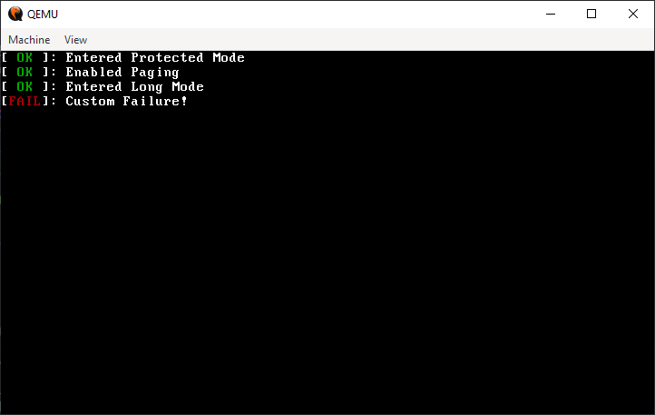

# Printing To Screen

_"The most effective debugging tool is still and careful thought, coupled with judiciously placed print statements." - Brian Kernighan_

---

#![repository_card]

Printing is an important aspect of an operating system, especially in early development because it is our way to gain a visual output from our operating system. This will massively improve the interaction with our OS, and not only will it give us a huge advantage in debugging, but it will also grant us the ability to display a shell, which we will do in the upcoming chapters.

## Why didn't we print until now?

If you remember the [example code](./ch01-02-booting-our-binary.md#hello-world) in the first bootable code we wrote, we did print to screen during that code.
This print utilized the `Video (int 10h)` interrupt on BIOS with the `Print Char (0xE)` function to print character by character the string 'Hello, World!' 

This was our only way to print we were on `real mode`. And while I developed the code, I actually did use it to print single characters as errors code, So I could understand what was my program doing.

On `protected mode`, we couldn't use the BIOS anymore, so printing was much harder. Additionally, we only turned on paging, so debugging with [QEMU monitor](https://qemu-project.gitlab.io/qemu/system/monitor.html) was much easier.

While we could have written a simple printer for each stage, it was not necessary, and it would have bloated our binary, which in the first stage had only 512 bytes, and had almost no use in the second stage. But now, on the kernel init stage, it would become really handy!

## How to print without BIOS?

We are gonna print using the Video Graphics Array or VGA for short. This protocol as the name suggests, puts an array in memory which will represent our screen. When we want to print, we simply write the content to the array, and it will automatically refresh on certain interval display to newly provided content.

## The VGA Protocol

VGA has primarily two modes, the first one is called `graphic mode`, which is used to write raw pixels to the screen. The second mode is called `text mode` and it is used to write text to the screen. In this chapter we are going to focus on the `text mode` because we mostly want to provide messages and text on the screen. 

_Maybe on later chapters we will implement UI, so we will a more graphic mode, but then we actually might not use VGA_

### Printing with Text Mode

To print with text mode, we need to write to the screen buffer a special character that is 2 bytes long. This special character encodes the actual ASCII character that we are going to print, the background color of the text, and the foreground color of the text. 

> The screen buffer of the `graphic mode` starts at address 0xA0000 and the screen buffer of the `text mode` starts at address 0xB8000. 

The first byte encodes the ASCII character, and it is not special. The second byte will encode our color, the first 4 bits will be the foreground color, and the next 4 bits will be the background color.

There are multiple color palettes that VGA uses, the one our mode uses, is the 4 bit color palette and it includes the following colors.

```rust
#![enum!("crates/common/src/enums/vga.rs", Color)]
```

```rust
#![struct!("crates/drivers/vga-display/src/color_code.rs", ColorCode)]

#![impl!("crates/drivers/vga-display/src/color_code.rs", ColorCode)]

#![trait_impl!("crates/drivers/vga-display/src/color_code.rs", Default for ColorCode)]
```

Then the encoding of each `Screen Character` will look like this.


```rust
#![struct!("crates/drivers/vga-display/src/screen_char.rs", ScreenChar)]

#![impl!("crates/drivers/vga-display/src/screen_char.rs", ScreenChar)]

#![trait_impl!("crates/drivers/vga-display/src/screen_char.rs", Default for ScreenChar)]
```

At this point, we are ready to write to the screen whatever we want, we just need to write a `ScreenChar` to the screen. But, this is not exactly what we want, because it is hard to print strings this way.

## Creating a Custom Writer

As always, rust has amazing features, and one of them is built in formatting on the core library.

> For those who are unfamiliar with the subject, formatting is turning a variable or a struct into a printable string.
>
> For example, if we have a variable `x` which holds the number `100`, how do we know how to print it? because it is not a string, formatting helps us with this 'type change'.
>
> You might be familiar with the [`printf`](https://en.wikipedia.org/wiki/Printf) function is C (Print Formatted), Rust offers us the [`fmt::Display`](https://doc.rust-lang.org/core/fmt/trait.Display.html) and [`fmt::Debug`](https://doc.rust-lang.org/core/fmt/trait.Debug.html) traits to handle formatting

But what does it mean for us? It means that if we implement our custom writer (which just needs to print regular ASCII strings), we freely get the ability to print variables in the code, and complex structs, since they can be easily derived by the Debug trait.

To create our custom writer we just need to implement the [`fmt::Writer`](https://doc.rust-lang.org/core/fmt/trait.Write.html) trait on a custom struct. Our simple writer, will just include place we currently are on the screen, the color the print has, and, and a reference to the screen buffer.

```rust
#![struct!("crates/drivers/vga-display/src/writer.rs", Writer)]

#![trait_impl!("crates/drivers/vga-display/src/writer.rs", Default for Writer)]
```

Then, we need to handle the following functionalities: 

1. If a character is in ASCII range, write it to the buffer at cursor position, and advance the cursor.

2. If the `\n` character was entered, don't print anything, but put the cursor at the start of the next line.

3. If `Backspace` or `Delete` character were entered, move the cursor back one position, and fill that position with the default character.

4. If we are at the end of the screen, we need to scroll down a line, which means to copy the entire buffer one line to the left[^1].

[^1]: Our buffer represents a 2D grid of `ScreenChar` elements, but it is actually just one big 1D buffer. So copying the entire buffer one line up is equivalent to shifting all the characters one line to the left.

5. Function to clear the screen entirely

Now that we have all the functionality in mind, we can go right into the implementation!

```rust
#![impl_method!("crates/drivers/vga-display/src/writer.rs", Writer::write_char, scroll_down, new_line, backspace, clear)]
```

> For now, the `change_cursor_position_on_screen` function is not relevant, and it uses I/O instruction to change the cursor position. This will be covered in future chapters.

With this, we are ready to implement the `fmt::Writer` trait on our struct. Because it only requires us to implement the `write_str` function, which is easy to implement because we have our `write_char` function.

```rust
#![trait_impl!("crates/drivers/vga-display/src/writer.rs", Write for Writer)]
```

The only thing that is missing is to initialize the writer, and write a function that will also print with a custom color, this function is relatively straight forward, and it will just change the color, print the message, and restore the color back to default.

```rust
#![static!("crates/drivers/vga-display/src/lib.rs", WRITER)]
#![function!("crates/drivers/vga-display/src/lib.rs", vga_print)]
```

An example usage, could be an OK message of what we already initialized!

```rust
#![function!("snippets/src/book/ch03_00/print_example.rs", _start)]
```

<pre><figure><figcaption></figcaption></figure></pre>

## Exercise

1. The standard library has a `print!` and `println!` macros, we are really close for one, implement it!

2. Implement the `okprintln!` and `eprintln!` that we used above.

Answers can be found at [here](https://github.com/sagi21805/LearnixOS/blob/master/crates/drivers/vga-display/src/lib.rs#37)
